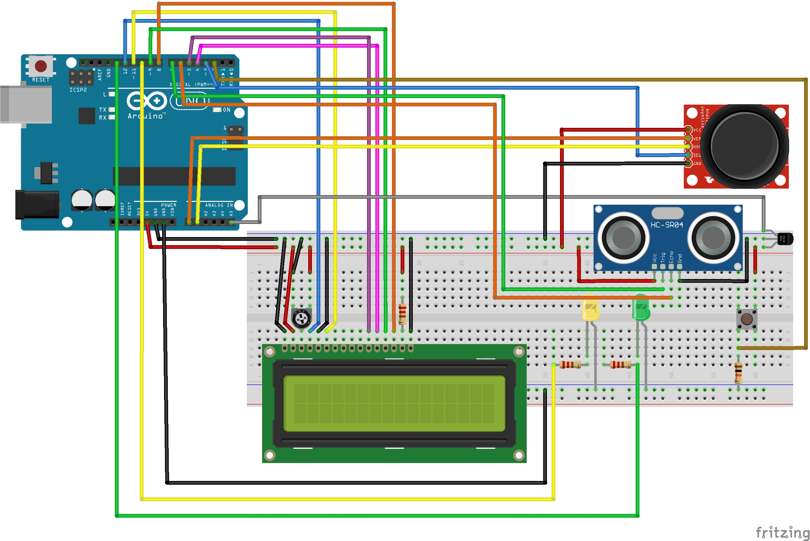

# BLOG_P3_SETR

David Pons Canet
01/12/24

## Objetivo

Se busca diseñar e implementar un controlador para una máquina expendedora que esté basado
en Arduino UNO y en los sensores/actuadores que se proporcionan en el kit Arduino. La práctica
tendrá que integrar obligatoriamente los siguientes componentes hardware:

  ● Arduino UNO
  ● LCD
  ● Joystick
  ● Sensor Temperatura/Humedad DHT11
  ● Sensor Ultrasonidos
  ● Botón
  ● 2 LEDS normales (LED1, LED2)

La maquina expendedora, consta de tres fases, ARRANQUE(setup), SERVICIO y ADMIN (maquina de estados).


## Arranque

Para implementar el arranque de la maquina expendedora, como algo que solo se tiene que ejecutar 
una vez, al iniciarse la placa, he decidido crear una funcion 'startup' y llamarla solo una vez
en el setup.

Para el control del led en el arranque, he decidido usar la librería thread. Esta libreria me permite 
poder simular un thread que ejecute cada x timepo. He creado una clase LedThread, que me permite crear
un "thread" para que el led pueda parpadear cada segundo.


## Servicio

Para el desarrollo de servicio, lo he hecho con maquinas de estado. Hay dos estados principales
(WAIT y SELL). 

En este estado SERVICE, comprobamos si el boton ha estado pulsado durante 2-3 segundos para reiniciar
el estado de SERVICE.

Dentro de WAIT, hay una maquina de estados, con los estados DISTANCE y SENSORS. En el estado DISTANCE
printea en el lcd "esperando client" hasta que detecta una pesona a menos de 1m, y pasa al estado
SENSORS, donde durante 5 segundos enseña los valores del sensor de temperatura y humedad., despues 
activa el estado SELL, a la vez que vuelve a dejar este subestado a DISTANCE, porque una vez acabe
este cliente vuelva a esperar una persona.

En el estado SELL, hay otra maquina de estados con los subestados, SELECT, PREPARE y RETIRE.
en SELECT permitimos movernos por el menu y seleccionar el producto deseado. En PREPARE, simulamos
la preparacion del producto con un led encendiendose gradualmente. Y RETIRE, simplemente esperamos 
tres segundos desde que el producto esta listo.

Para moverme por el menu, lo hago a traves de un joystick. Con el metodo get_direction, me devuelve 
la posicion en la que esta el joystick, y con el metodo get_joystick con el resultado de get_direction
me permite moverme arriba y abajo por el menu.

Para seleccionar el producto usamos el metodo selectOption con argumento = 1, ya que queremos ejecutar
la funcion 1 definida para esa linia.


## Admin

Una vez se setea el modo admin, se enseña la pantalla 2 del menu. 

La funcionalidad de admin, tambien es una maquina de estados, con los estados SENSORS, DISTANCE,
COUNTER, PRICES,  y NONE.

En el estado SENSORS, simplemente mostramos los valores de los sensores, en DISTANCE la distancia, 
y en COUNTER el contador de sengundos que la placa lleva encendida.

En el estado PRICES, hay otra maquina de estados con los subestados SELECT y MODIFY. Cuando entramos
a PRICES, volvemos a cambiar a la pantalla 1 del menu para que vuelvan a salir los productos, para poder
seleccionar el producto a modificar.
En SELECT, solo la usamos para seleccionar el producto a modificar con selectOption, pero esta vez con
argumento = 2, para ejecutar la segunda funcion designada para esa linea del menu (modificar los precios).
Y en MODIFY, ejecutamos la funcion para modificar el precio como nos piden los requerimientos.

En el estado NONE, podemos navegar por el menu de la misma forma que en SERVICE.

## Interrupciones

### Service-Admin

Para cambiar de modo entre admin y service, lo hacemos a traves de un boton, conectadoa una interrupcion 
fisica del Arduino en modo CHANGE.

Por lo que cada vez que el estado del boton cambie, va a invertir el valor de un booleano 'reset', y se
guardara el tiempo actual, para en el bucle principal, poder ir calculando el tiempo que lleva pulsado el
boton. Y tambien para evitar rebotes(pulsaciones fantasma).

```c++
  attachInterrupt(digitalPinToInterrupt(INT_PIN), button_mode, CHANGE);

  void button_mode() {
    if ((millis() - last_reset) > BOUNCE_DELAY) {
      reset = !reset;
      init_time = millis();
      last_reset = millis();
    }
  }
```

Utilizamos last_reset para saber el tiempo que lleva sin recibir señal del boton, y si es mayor a un
BOUNCE_DELAY, consideramos que es una pulsacion valida.


### Select joystick

Para seleccionar los elemenos del menu, usamos el boton que incorpora el joystick, el cual tambien lo
vamos a conectar a una interrupcion fisica.

El funcionamiento es el mismo que con la otra interrupcion.

```c++
  attachInterrupt(digitalPinToInterrupt(SW_PIN), joystick_button, CHANGE);

  void joystick_button() {
    if ((millis() - last_joy) > BOUNCE_DELAY) {
      joy = !joy;
      last_joy = millis();
    }
  }
```


## Watchdog

Watchdog es un mecanismo de seguridad, el cual nos reinicia el sistema, si la placa se ha quedado 
pillada. He decidido setear el watchdog en 8 segundos, ya que he considerado que en una maquina 
expendora, no seria critico si se enganchara un momento.


## Esquema electronico



